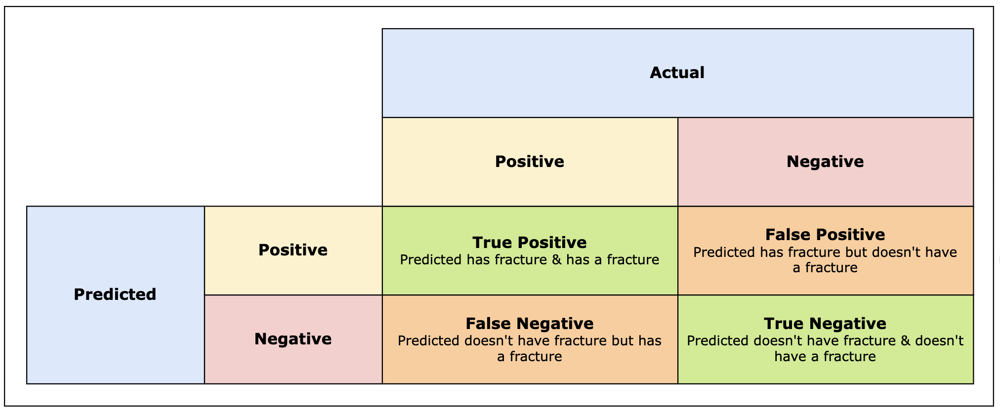
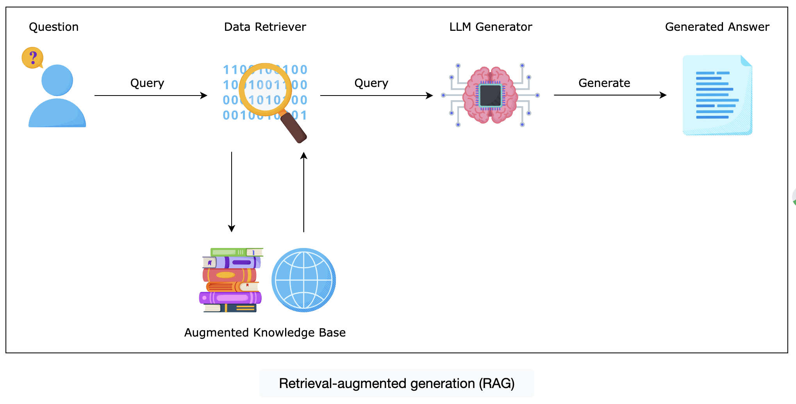

# Understanding Transformers

## Challenges and considerations

One of the challenges in creating good embeddings is the quality and diversity of the training data. Embeddings represent words based on their context in the training data. So, if the data is biased, if it lacks diversity, or if it contains errors, then the resulting embeddings will be inaccurate or unfair. Ensuring that the training data encompasses a broad range of linguistic styles, dialects, and expressions is essential for developing chatbots that are capable of understanding a diverse user base.

## Computational Challenges
### Vector Space Complexity
Embeddings represent words in a high-dimensional vector space so as to capture semantic relationships, but this introduces computational challenges. Managing the complexity of vectors in high-dimensional spaces requires careful consideration of the model architecture and parameters. 

<!--

This section contains notes on Dimensionality Reduction, a technique used in machine learning and data analysis to reduce the number of features in a dataset while preserving as much information as possible. This can help improve the performance of machine learning models and make data visualization more manageable.
-->

### Dimensionality Reduction

 * Techniques such as dimensionality reduction are used to reduce the number of features in a dataset 
 * while retaining as much important information as possible. This can help mitigate challenges 
 * associated with high-dimensional data but may also reduce the accuracy of the model or its semantic richness.

Techniques such as dimensionality reduction, a statistical technique used to reduce the number of features in a dataset while retaining as much important information as possible, can help mitigate these challenges but may also reduce the accuracy of the model or its semantic richness.

## Ethical Considerations
### Privacy and Bias Concerns
There are also ethical considerations related to privacy, consent, and bias when dealing with embeddings. Embeddings trained on user-generated content may capture and spread biases present in the data, leading to discriminatory or insensitive responses from the chatbot. 

### Mitigation Strategies
To counter these challenges, we need to have transparent data practices and bias auditing for feedback and correction when biases are identified.

## Here is a model that is trained on poetry and can be used for poetry evaluation: 
https://arxiv.org/html/2406.18906v1#abstract

## Applying Positional Encoding and Embedding with Transformers 
### Introduction to positional encoding 

Let’s take a sentence as an example to illustrate the importance of the position of words in a sentence. Sentence 1 is: “*Machine learning algorithms find patterns in data.*” Notice how the words are spread on the Cartesian plane below and their corresponding x-axis and y-axis coordinates. 

Both sentences 1 and 2 have the exact same number of words and the exact words, but their order is different. Now, notice how the x-axis and the y-axis coordinates are different, although we have the same words. Words in high dimensional space are affected by their position, and thus their context or meaning is different depending on the word order in the sentence.

Moreover, the same word can have two different meanings depending on the context and order of the sentence. In general, a word's context is determined by the words close to it, the subject, or the verb that precedes or follows it.

Let’s look at another example that demonstrates how the same word can have two different meanings. In the following sentences, “The AI classified the apple as a fruit with 98% confidence” and “Apple invested heavily in AI to improve their virtual assistant’s performance,” the word “apple” is present in both sentences. In the first sentence, “apple” is a fruit, and thus, the positional encoding algorithm pushes the word toward the fruit context. In the second sentence, “Apple” is the technology brand, so the positional encoding algorithm pushes the word toward the technology context.

The positional encoder utilizes sine and cosine functions to encode the absolute positions of each word in the sentence. The use of this function is strategic because the periodic nature of these functions allows the model to easily learn how to attend to relative positions, given that for any fixed offset k, sin⁡(x+k) and cos⁡(x+k) can be represented as a linear function of sin⁡(x) and cos⁡(x). Therefore, the model determines the position of a word relative to other words in the sequence, which allows it to understand the context. Each word’s positional encoding is added to its embedding, combining semantic and positional information into a single representation which is fed into the transformer’s layers.

### Positional Encoding Formula
$$
PE_{(pos,2i)} = sin(pos/10000^{2i/d_{model}})
$$
$$
PE_{(pos,2i+1)} = cos(pos/10000^{2i/d_{model}})
$$

In the above formula, PE refers to the positional encoder, pos to the position of the word in the sentence, i to the dimension index within the word embedding, and 
d−model to the vector dimension of the embedding itself. In that sense, the combination of the sine and the cosine functions serve as a unique encoding vector that allows the model to handle any sequence of any length.

The **transformers** library can perform embedding and positional encoding simultaneously. There are hundreds of pretrained embedding libraries on Hugging Face that we can use. 

Hugging Face has a really easy-to-use Python function for using transformers. pipeline is a function that can take a task, a model, and a tokenizer and pipe them all to produce the desired output. There are many tasks in natural language processing, including text classification, question answering, translation, and text generation. When we choose a model or task in Hugging Face, we click it and check the provided code that illustrates how to use that specific model with transformers.

## Challenges and considerations #

Implementing positional encoding in transformer models presents a few challenges and considerations. These challenges arise from the need to balance the effectiveness of the positional encoding in capturing the order of the words with the model’s performance and semantic meaning. Positional encodings should not overshadow the semantic meaning of the words themselves because the embeddings provide essential information about the meaning and context of the words. Finding the correct balance requires tuning the magnitude and representation of the encodings.

The sine and cosine functions in positional encodings represent positions as a function of their relation to one another. However, as sequences become longer, distinguishing between further positions based only on these functions becomes challenging. This is the area where we see transformers struggling to handle long documents or conversations, but day after day, transformers are getting enhanced with longer context lengths. Moreover, positional encodings add an additional step in the data preprocessing pipeline, which impacts the overall computational efficiency of the training and the inference process. Positional encodings are calculated for each word in the sequence for every input, which can be computationally demanding for real-time applications such as conversational chatbots.

## Scaling LLMs#
However, we have to be careful when stating such a hypothesis because we are increasingly seeing smaller models reaching a quality, a capacity, and an understanding of the text that is just a bit below the large-scale models. This is primarily due to the quality of data that these smaller models are being trained on. This is an eye-opener because it demonstrates the famous saying: “Garbage in, garbage out.” In other words, when training a model on quality, cleaned, and filtered data, we can hypothetically achieve great results on par with the results achieved by a large-scale model.

## LLMs are opaque-boxes
LLMs are opaque-box models. It is extremely difficult to interpret their results or to know how they generated these results. And when we say, generated their results, it is because LLMs are generative models. They don’t reply back to questions based on predefined answers, but they rather analyze, connect the dots, and generate an answer. In the legal domain, it is essential to understand and trust the language models. LLMs can assist lawyers by reviewing and summarizing huge amounts of legal documents, but we still have to make sure that the recommendations can be trusted by legal professionals.

The answers are, in fact, sampling over a probability distribution, whereby the model selects the best probable word that follows the preceding word to generate text or predictions. That is why it is difficult to understand how the text was generated.

## Hallucinations

## Grounding Method
Grounding methods consist of limiting the interaction of the model to a certain type of data or augmenting the model’s data with specific domain knowledge, which is referred to as retrieval-augmented generation or RAG. Retrieval augmented generation is a method designed to enhance the reliability and accuracy of LLMs by combining the generative capabilities of LLMs with the precision of information retrieval. This approach involves augmenting the model’s training data with specific domain knowledge to ground the model by limiting its search to factual and relevant information. During the inference phase, RAG queries a database or corpus of documents to retrieve contextually relevant information before generating a response.

## RAG Flow 
 

## Context length
The context length refers to the maximum length of the vector that can be injected into the LLMs as input. Context length can be 16k, 24k, or 32k for example. The larger the context length, the more processing power and GPUs are needed to run the models, and we can imagine that we are always limited by the latest available capacity and computational power of the available computers.

## LLM Models 

| LLM    | RELEASED   | License | Maintainer | link   | Architecture      | Params (Bn) | Token Length |
| ----   | ---------  |---------|------------|--------|-------------------|-------------|------------- |
| AutoGPT| 01/03/2023 | OpenAI  | MIT        | GitHub | Encoder - Decoder | 175 -> 1000 | 8,192        |
| BERT|01/10/2018|Google |Apache 2.0|Google Cloud|Encoder|340|512|
|BLOOMChat|01/05/2023|SambaNova & Together Computer|BLOOMChat-176B LICENSE v1.0|Hugging Face|Decoder|176|NA|
|Cerebras-GPT|01/03/2023|Cerebras|Apache 2.0|Hugging Face|Decoder|0.111 - 13|2,048|
|Claude|01/03/2023|Anthropic|N/A|Anthropic|NA|NA|100,000 tokens|
