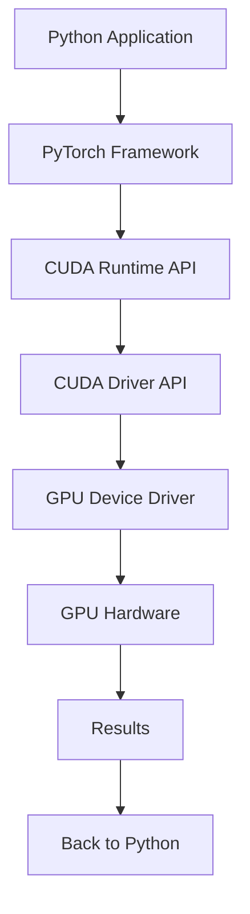

# From Python to GPU: Understanding CUDA Execution Pipeline

> A comprehensive guide to understanding how PyTorch leverages CUDA to execute tensor operations on GPU hardware

## Table of Contents

- [Overview](#overview)
- [Prerequisites](#prerequisites)
- [The Complete Execution Pipeline](#the-complete-execution-pipeline)
- [Step-by-Step Breakdown](#step-by-step-breakdown)
- [Code Examples](#code-examples)
- [Architecture Summary](#architecture-summary)
- [Common Terminology](#common-terminology)
- [Troubleshooting](#troubleshooting)
- [Further Reading](#further-reading)

## Overview

Have you ever wondered what happens when you run a simple PyTorch operation like `torch.tensor([1, 2, 3], device='cuda')`? This tutorial demystifies the entire execution pipeline from your Python code to the actual GPU hardware computation.

### What You'll Learn

- The complete journey from Python code to GPU execution
- How PyTorch, CUDA, and GPU drivers collaborate
- Real-world code examples at each layer
- The difference between various "kernel" concepts
- How to optimize your GPU code understanding

## Prerequisites

- Basic Python programming knowledge
- Familiarity with PyTorch tensors
- NVIDIA GPU with CUDA support
- PyTorch with CUDA installed

```bash
# Verify your setup
python -c "import torch; print(torch.cuda.is_available())"
```

## The Complete Execution Pipeline



## Step-by-Step Breakdown

### 1. 🐍 Python Application Layer

**Your Code:**
```python
import torch

# Create tensors on GPU
A = torch.tensor([1, 2, 3], device='cuda')
B = torch.tensor([4, 5, 6], device='cuda')

# Perform computation
C = A + B
print(C)  # tensor([5, 7, 9], device='cuda:0')
```

**What Happens:**
- PyTorch interprets your high-level Python commands
- `device='cuda'` signals GPU placement
- Operations are queued for GPU execution

### 2. 🔧 PyTorch Framework Layer

**Internal Translation:**
```cpp
// PyTorch's internal C++ representation
auto tensorA = at::tensor({1, 2, 3}).to(at::kCUDA);
auto tensorB = at::tensor({4, 5, 6}).to(at::kCUDA);
auto tensorC = tensorA + tensorB;
```

**Key Operations:**
- Type checking and tensor metadata management
- Memory layout optimization
- Kernel selection based on tensor properties
- Automatic differentiation graph construction (if required)

### 3. 📐 CUDA Runtime API Layer

**Memory Management:**
```cpp
// Allocate GPU memory
float* gpu_ptr_A;
float* gpu_ptr_B;
float* gpu_ptr_C;

cudaMalloc((void**)&gpu_ptr_A, 3 * sizeof(float));
cudaMalloc((void**)&gpu_ptr_B, 3 * sizeof(float));
cudaMalloc((void**)&gpu_ptr_C, 3 * sizeof(float));

// Copy data to GPU
cudaMemcpy(gpu_ptr_A, host_data_A, 3 * sizeof(float), cudaMemcpyHostToDevice);
cudaMemcpy(gpu_ptr_B, host_data_B, 3 * sizeof(float), cudaMemcpyHostToDevice);
```

**Kernel Execution:**
```cpp
// Launch kernel
dim3 blockSize(256);
dim3 gridSize((3 + blockSize.x - 1) / blockSize.x);
vector_add<<<gridSize, blockSize>>>(gpu_ptr_A, gpu_ptr_B, gpu_ptr_C, 3);

// Synchronize
cudaDeviceSynchronize();
```

### 4. 📌 CUDA Driver API Layer

**Lower-Level Operations:**
```cpp
// Driver API equivalents
CUdeviceptr dptr_A, dptr_B, dptr_C;
cuMemAlloc(&dptr_A, 3 * sizeof(float));
cuMemAlloc(&dptr_B, 3 * sizeof(float));
cuMemAlloc(&dptr_C, 3 * sizeof(float));

// Launch kernel via driver API
cuLaunchKernel(function, gridX, gridY, gridZ, blockX, blockY, blockZ, 
               sharedMemBytes, stream, kernelParams, extra);
```

**Purpose:**
- Direct hardware abstraction
- Maximum control over GPU resources
- Platform-specific optimizations

### 5. 🛠️ GPU Device Driver Layer

**Platform-Specific Drivers:**

**Linux:**
```bash
# Load NVIDIA driver module
sudo modprobe nvidia

# Check driver status
nvidia-smi
```

**Windows:**
```
# Automatically loaded drivers
nvcuda.dll      # CUDA driver
nvapi64.dll     # NVIDIA API
```

**Driver Responsibilities:**
- Hardware abstraction
- Memory management
- Command scheduling
- Power management
- Error handling

### 6. 🖥️ GPU Hardware Layer

**CUDA Kernel Example:**
```cuda
__global__ void vector_add(float *A, float *B, float *C, int N) {
    // Calculate thread index
    int idx = blockIdx.x * blockDim.x + threadIdx.x;
    
    // Bounds checking
    if (idx < N) {
        C[idx] = A[idx] + B[idx];
    }
}
```

**Hardware Execution:**
- Streaming Multiprocessors (SMs) execute warps of 32 threads
- Memory hierarchy: Global → L2 Cache → L1 Cache → Registers
- Parallel execution across thousands of CUDA cores

### 7. 📩 Result Retrieval

**Getting Results Back:**
```python
# Transfer result to CPU
result = C.cpu().numpy()
```

**Underlying CUDA Code:**
```cpp
// Copy result back to host
float* host_result = (float*)malloc(3 * sizeof(float));
cudaMemcpy(host_result, gpu_ptr_C, 3 * sizeof(float), cudaMemcpyDeviceToHost);
```

## Code Examples

### Complete Working Example

```python
import torch
import time

def benchmark_gpu_vs_cpu():
    # Create large tensors
    size = 1000000
    
    # CPU computation
    start_time = time.time()
    a_cpu = torch.randn(size)
    b_cpu = torch.randn(size)
    c_cpu = a_cpu + b_cpu
    cpu_time = time.time() - start_time
    
    # GPU computation
    start_time = time.time()
    a_gpu = torch.randn(size, device='cuda')
    b_gpu = torch.randn(size, device='cuda')
    c_gpu = a_gpu + b_gpu
    torch.cuda.synchronize()  # Wait for GPU completion
    gpu_time = time.time() - start_time
    
    print(f"CPU time: {cpu_time:.4f}s")
    print(f"GPU time: {gpu_time:.4f}s")
    print(f"Speedup: {cpu_time/gpu_time:.2f}x")

if __name__ == "__main__":
    benchmark_gpu_vs_cpu()
```

### Custom CUDA Kernel Integration

```python
import torch
from torch.utils.cpp_extension import load_inline

# Custom CUDA kernel source
cuda_source = '''
__global__ void vector_add_kernel(float* a, float* b, float* c, int n) {
    int idx = blockIdx.x * blockDim.x + threadIdx.x;
    if (idx < n) {
        c[idx] = a[idx] + b[idx];
    }
}

torch::Tensor vector_add_cuda(torch::Tensor a, torch::Tensor b) {
    auto c = torch::zeros_like(a);
    int n = a.numel();
    
    dim3 block(256);
    dim3 grid((n + block.x - 1) / block.x);
    
    vector_add_kernel<<<grid, block>>>(
        a.data_ptr<float>(),
        b.data_ptr<float>(),
        c.data_ptr<float>(),
        n
    );
    
    return c;
}
'''

cpp_source = '''
torch::Tensor vector_add_cuda(torch::Tensor a, torch::Tensor b);
'''

# Compile and load the extension
vector_add = load_inline(
    name='vector_add',
    cpp_sources=cpp_source,
    cuda_sources=cuda_source,
    functions=['vector_add_cuda']
)

# Usage
a = torch.randn(1000, device='cuda')
b = torch.randn(1000, device='cuda')
c = vector_add.vector_add_cuda(a, b)
```

## Architecture Summary

| Layer | Interface | Primary Function | Example API |
|-------|-----------|------------------|-------------|
| **Python Application** | PyTorch Python API | High-level tensor operations | `torch.tensor(device='cuda')` |
| **PyTorch Framework** | C++ ATen library | Tensor management & dispatch | `at::tensor().to(at::kCUDA)` |
| **CUDA Runtime** | CUDA Runtime API | Memory & kernel management | `cudaMalloc()`, `cudaLaunchKernel()` |
| **CUDA Driver** | CUDA Driver API | Low-level GPU control | `cuMemAlloc()`, `cuLaunchKernel()` |
| **Device Driver** | OS kernel module | Hardware abstraction | `nvidia.ko`, `nvcuda.dll` |
| **GPU Hardware** | Physical silicon | Parallel computation | SM execution, memory hierarchy |

## Common Terminology

### Understanding "Kernel" Contexts

1. **Operating System Kernel**
   - Core of the operating system (Linux, Windows)
   - Manages system resources and hardware access

2. **Device Driver Kernel Module**
   - Specialized code loaded into OS kernel space
   - Example: `nvidia.ko` on Linux

3. **CUDA Kernel**
   - GPU functions that execute in parallel
   - Written with `__global__` qualifier

### Memory Hierarchy

```
CPU Memory (Host)
    ↕️ PCIe Transfer
GPU Memory (Device)
    ├── Global Memory (VRAM)
    ├── L2 Cache
    ├── L1 Cache/Shared Memory
    └── Registers
```

## Troubleshooting

### Common Issues and Solutions

**1. CUDA Out of Memory**
```python
# Check memory usage
print(f"Allocated: {torch.cuda.memory_allocated() / 1024**2:.1f} MB")
print(f"Cached: {torch.cuda.memory_reserved() / 1024**2:.1f} MB")

# Clear cache
torch.cuda.empty_cache()
```

**2. Device Synchronization**
```python
# Ensure GPU operations complete before timing
torch.cuda.synchronize()
```

**3. Driver Compatibility**
```bash
# Check NVIDIA driver version
nvidia-smi

# Check CUDA version
nvcc --version
```

## Performance Tips

1. **Minimize Host-Device Transfers**
   ```python
   # Bad: Multiple transfers
   for i in range(100):
       result = (tensor_gpu + i).cpu()
   
   # Good: Single transfer
   results = []
   for i in range(100):
       results.append(tensor_gpu + i)
   final_results = [r.cpu() for r in results]
   ```

2. **Use Appropriate Data Types**
   ```python
   # Use float16 for memory efficiency when possible
   tensor_fp16 = torch.randn(1000, dtype=torch.float16, device='cuda')
   ```

3. **Batch Operations**
   ```python
   # Vectorize operations when possible
   # Instead of loops, use tensor operations
   result = torch.sum(tensor_batch, dim=0)
   ```

## Further Reading

- [CUDA Programming Guide](https://docs.nvidia.com/cuda/cuda-c-programming-guide/)
- [PyTorch CUDA Documentation](https://pytorch.org/docs/stable/cuda.html)
- [NVIDIA Deep Learning Performance Guide](https://docs.nvidia.com/deeplearning/performance/)
- [PyTorch Custom CUDA Extensions](https://pytorch.org/tutorials/advanced/cpp_extension.html)

---

## Contributing

Found an error or want to improve this tutorial? Please:
1. Fork this repository
2. Create a feature branch
3. Submit a pull request

## License

This tutorial is released under the MIT License. See [LICENSE](LICENSE) for details.

---

*Last updated: June 2025*